# Структура, функции и процессы в технических системах
Система – совокупность, образованная из конечного множества элементов и упорядоченная по определённым правилам, что обеспечивает достижение поставленной цели.

Между элементами системы существуют определенные отношения. Элемент может одновременно являться системой меньших элементов, а система в свою очередь может быть элементом некоторой большей системы.

Система может быть разделена на подсистемы различной сложности. Таким образом система может изучаться с различных точек зрения, зависящих не только от специфики системы, но и от возможностей используемых при этом средств. Так, например, при конструировании технических систем не рассматриваются молекулы и тем более атомы. 

Самым нижним уровнем в этом случае являются детали машин.
Назначение системы – всякая искусственная система имеет определенное назначение, которое может быть описано набором целей. Цель – это определенный результат, к которому следует стремиться.

Функционирование системы – целенаправленное поведение системы называют функцией. «Правильное» поведение систем называют функционированием.

Структура системы – понятие структуры характеризует внутреннюю организацию, порядок и построение системы. Таким образом, структура – совокупность элементов и отношений между ними.

Параметры системы – параметры, это величины количественно характеризующие определенные свойства системы.

Связь между структурой, параметрами и функцией системы – эта связь является важнейшей и наиболее характерной для системы. 

Функционирование системы определяется структурой и параметрами ее. Одна и та же функция может быть реализована разными структурами. При различных значениях параметров. Это приводит к неоднозначности процесса проектирования систем.

Окружение системы – окружение теоретически включает все то, что не входит в данную систему.

Вход и выход системы – вход есть внешнее отношение «Окружающая среда – система», а выход – внешнее отношение «Система – окружающая среда». Входная и выходная величины являются единственными связями системы с окружающей средой. Они включают все виды связи – материальные, энергетические и информационные
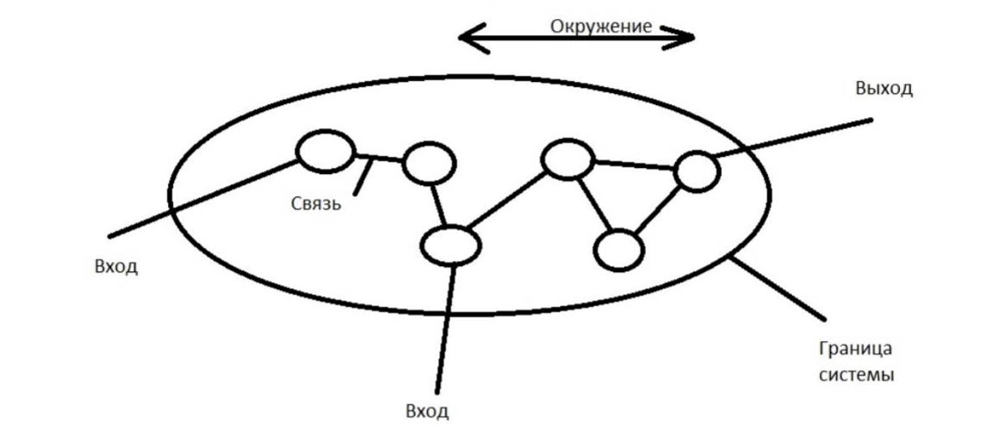

Процесс – изменение с течением времени. Наряду с естественными процессами, человек с целью осуществления необходимых для него изменений организует искусственные процессы. Искусственные процессы, в которых те или иные свойства объекта, над которым совершают действие претерпевают необходимые изменения при участии людей и технических средств, называются преобразованиями

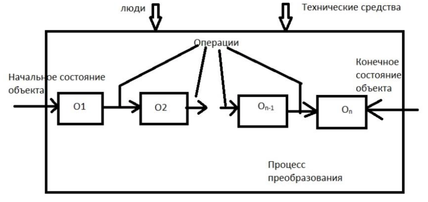

Типичными видами преобразования в системах являются управление и регулирование. Управление – процесс, в ходе которого одна или несколько входных величин действуют требуемым образом на другие, обеспечивая достижение ими необходимых значений. Регулирование – частный случай процесса управления, когда необходимые значения выходных величин определены заранее, и процесс сводится к приведению отклонений выходных величин от их необходимых значений к нулю.

Техническая система – совокупность машин, механизмов, устройств и других орудий, обеспечивающих человечеству возможность воздействия на окружающую среду, с целью получения в конечном итоге материальных благ.
Таким образом, техническая система – продукт деятельности человека, отражающий уровень цивилизации и успехи, достигнутые в различных областях деятельности.

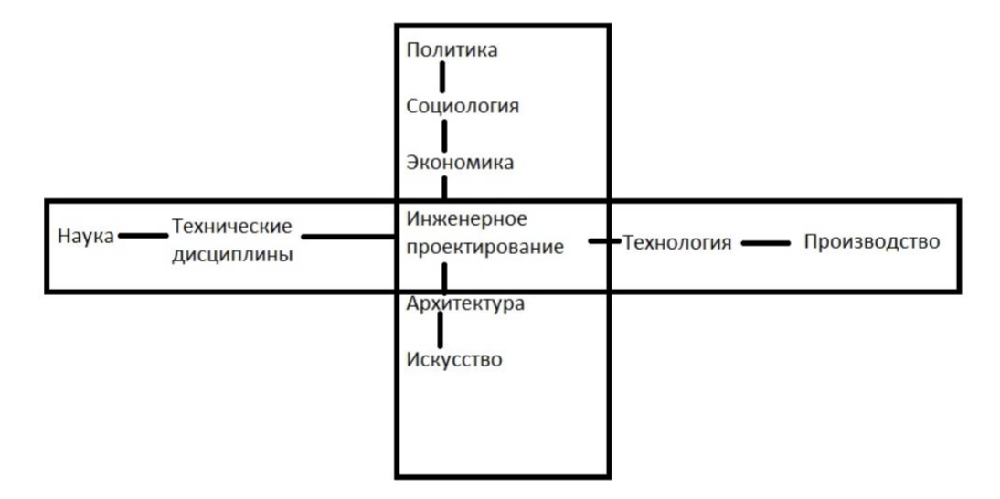

## Классификация систем
Технические системы классифицируются следующим
образом:
1. По положению в иерархии (надсистема, система, подсистема);
2. по связям с окружением (открытые, закрытые);
3. по изменению состояния (статические, динамические);
4. по характеру функционирования (детерминированные,
стохастические);
5. по типу элементов (конкретные, абстрактные);
6. по происхождению (естественные, искусственные):
7. по характеру зависимости выходов от входов
(комбинаторные, у которых выход зависит только от входа и
секвентивные, у которых выход зависит не только от входа, но и
от других величин).
8. по степени сложности (простые, сложные, очень сложные,
предельно сложные);
9. по виду элементов (системы типа «объект», элементами
которых являются предметы, и системы типа «процесс»,
элементами которых являются операции). ТС типа «объект» –
это автомобиль, станок, реактор, дробилка, а ТС типа «процесс»
– это точение, фрезерование, фильтрация, перегонка, дробление,
размалывание.

Основой для построения этой модели являются следующие предположения:
1. желаемые преобразования объекта (операнды) достигаются
целенаправленными воздействиями материального (М),
энергетического (Э) и информационного (И) типов;
2. эти воздействия при любом преобразовании осуществляются
людьми (Л), техническими системами (ТС) и окружающей
средой (ОС).

Для осуществления требуемого преобразования либо
выбирают требуемый объект, либо задают требуемое состояние
операнда. Операндами могут быть люди, животные,
материальные, энергетические или информационные объекты.
Если начальное состояние операнда Од(1), а конечное Од(2), то
изменение Од(1) → Од(2) называется преобразованием. Такое
преобразование вызывается противоречием между тем что есть,
и тем что требуется. Преобразования выполняются на основе
некоторых правил, технологии, представляющей собой упорядоченную
последовательность целенаправленных частных
изменений (переходов). Состояние Од(2) может быть
достигнуто различными способами (технологиями). Внутри
самих технических систем также осуществляются преобразования:
вращательное движение преобразуется в поступательное,
давление возрастает или уменьшается и т. д.

## Элементы системы преобразований
Элементы системы преобразований могут выполнять
различные роли, например, быть активными или пассивными.
Операнд – это пассивный элемент технической системы. Он
может относиться к любой из четырех категорий: люди,
материя, энергия, информация, либо быть их комбинацией.
Состояние операнда может быть определено как совокупность
свойств либо как совокупность операндов – составных частей
технической системы

Люди, как операторы системы преобразований, могут быть
определены как подмножество людей, включающее только тех,
кто выполняет какой-либо вид действий для определенного
преобразования.

Реальное окружение (окружающая среда) – это оператор,
охватывающий все источники внешних воздействий: геосферу
(сушу и воду), атмосферу, климат (погоду), биосферу,
техносферу.

Элементы геосферы, биосферы и атмосферы образуют
экосистему, в рамках которой происходят все преобразования
материи, энергии, информации. Техносфера включает в себя все
технические системы, созданные человеком.

Типы элементов и действий, входящих в модель системы
преобразований можно представить в таблице

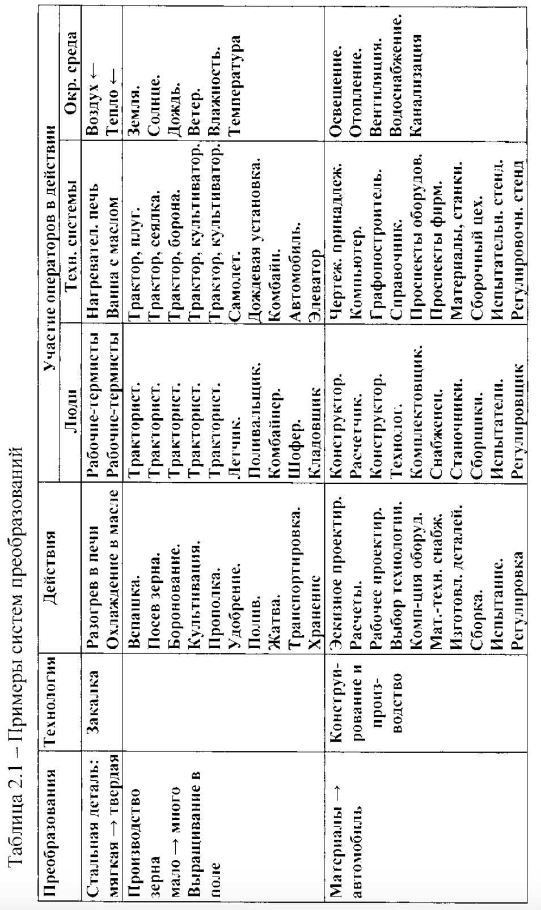

# Модель технологического процесса
## Структура модели технологического процесса
Техническим процессом называется такое преобразование, в котором роль операторов выполняют наряду с людьми и ТС.
Технический процесс является элементом системы преобразований. Модель технического процесса строится на отношениях в системе преобразований. МЭИ – материя, энергия, информация.

Характерными признаками технического процесса являются: 
1. конечное состояние операнда;
2. технологический принцип;
3. типы и последовательность операций;
4. результат каждой операции;
5. распределение результатов по операциям, соответствующее постановке задачи и требуемому конечному результату.
Указанные признаки можно рассматривать как степени свободы, имеющиеся при выборе, разработке и оптимизации технического процесса.

Принципиальная схема технического процесса определяется операциями, состояние которых требуется изменить. Последовательные входы и выходы должны быть однородными. Выход может быть только из тех составляющих, которые поступили на вход. Например, если на входе технического процесса металлическая заготовка, то на выходе – готовая деталь и металлическая стружка. Технический процесс должен охватывать только действия с операндами. Каждый технический подпроцесс или операция наряду с соответствующими частичными преобразованиями включает также соответствующие побочные процессы: управление, регулирование, материально - техническое снабжение и т. д. Каждый технический процесс, подпроцесс, операция проходят стадии подготовки, проведения и окончания в конкретном месте, конкретной ТС. в конкретное время и при конкретных параметрах окружающей среды.

## Модель технологического процесса, обслуживаемого человеком

Модель технического процесса может применяться в технике очень широко. Однако сё применение целесообразно только в тех случаях, когда в преобразованиях могут участвовать и участвуют только люди, а используемая техническая система имеет характер «машины», т. е. позволяет достичь требуемого результата без участия других технических систем. Такой системой может быть, например, комбайн, лопата, авторучка, но не коробка передач или подшипник  Процессы в технических системах очень специфичны по своему назначению и выполняются обычно одним оператором.

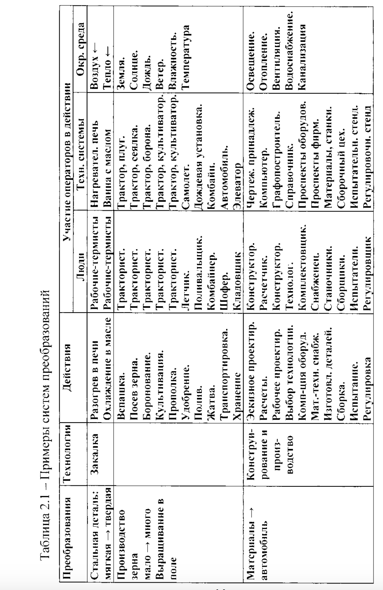

Операнд технического процесса одновременно является
также операндом системы преобразований. Различают четыре
класса операндов:

1. Живые существа. Независимо от того человек это или
животное, в техническом процессе изменяются либо
состояние (болен - здоров), либо местонахождение операнда.

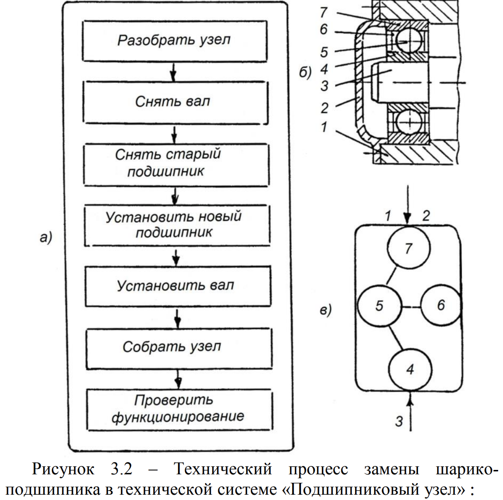

1 – корпус; 2 – крышка; 3 – вал; 4 – внутреннее кольцо;
5 – шарики; 6 – сепаратор; 7 – внешнее кольцо подшипннка
19
2. Материя. В техническом процессе изменяется: форма,
размеры, свойства, расположение.
3. Энергия. В техническом процессе изменяются давление,
температура, вид энергии и т. д.
4. Информация. В техническом процессе изменяется форма,
количество, качество, местонахождение информации.

## Структура технологического процесса
Преобразование операндов могут быть очень сложными.
Операнд проходит последовательно многочисленные
промежуточные состояния, а его свойства шаг за шагом
меняются. Изменение свойств операнда может происходить
непрерывно (например, нагрев) или скачкообразно (например,
штамповка). Операнды переходят в промежуточные состояния
посредством подпроцессов и операций в рамках технического
процесса. Структура технического процесса зависит от
технологии, под которой понимают согласованную
совокупность операций. Под операцией в этом случае понимают
элементарный процесс, соответствующий одному рабочему
действию, касающегося только одного операнда.

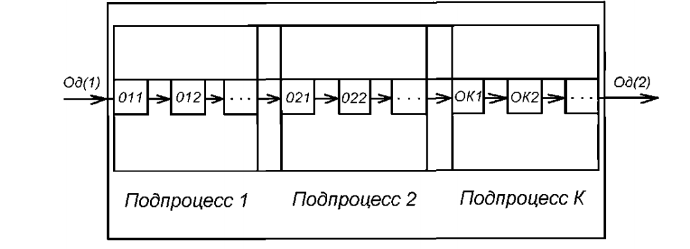

Модели технического процесса могут быть упрощенными
 и усложненными. Выбор модели зависит от
требуемой детализации технического процесса.

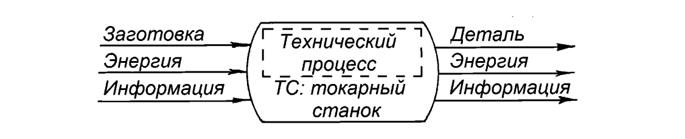

Технические процессы могут быть представлены
различными способами в зависимости от вида процесса, цели
представления, действующих инструкций или традиций.
1. Представление в вербальной (словесной) форме.
Словесное описание проще других, однако, оно может быть
неоднозначно истолковано и довольно длинное.
2. Представление в форме математического выражения. В
большинстве случаев оно наиболее точно описывает протекание
процессов и их зависимости.
3. Представление в специальной форме. Например, в
символической, на языке Ляпунова. Выражение ↓↑Aq↑↑B
означает: провести операцию А (например, обточку), затем
проверить, выполняется ли условие q(например, размер 90 с
допуском Н7). Если оно выполняется, то осуществить операцию
В (например, фрезерование шпоночного паза). Если оно не
выполняется, то повторить операцию А, что обозначается
стрелкой ↑ после q.
4. Представление в форме графа. Ребра графа
обозначают процессы, а узлы – состояние операндов. Выходы и
входы процессов изображают стрелками и точками.
5. Представление в виде блок-схемы. В этом случае
промесс изображают в форме прямоугольника с текстом или
рисунком.
6. Представление в форме временной диаграммы. Такая
диаграмма позволяет наглядно представить последовательность
и привязку операций во времени, что бывает полезным для
целей управления.

## Надежность и функционирование технических систем

Надежность— это важнейшее качество ТС которая в наибольшей степени определяет ее совокупную ценность.

Надежность— (по ГОСТУ) свойство ТС, которая состоит в способности ее выполнять определенные задачи в определенных условиях эксплуатации.

Наиболее сложными и важными для оценки надежности являются такие вопросы:
1. Задания целесообразных и оправданных требований по надежности системам разового назначения.
2. Выбор показателя который наиболее полном характеризует надежность.
На надежность показателя влияют разные факторы:
1. Назначение технической системы
2. Характер процесса ее функционирования или использования.
3. Определенные требования к самому показателю— простота его физического представления, возможность его априорного расчета и исследовательской проверки.

По этим причинам корректно оценивать надежность любой ТС единым показателем не возможно.

Надежность является комплексным понятием и включает в свой состав такие свойства системы как: безотказность, долговечность, ремонтопригодность, сохраняемость.

В зависимости от назначения ТС и условия ее эксплуатации надежность оценивают по значению одного из этих свойств или по их совокупности

Работоспособность — состоянии ТС при котором она способна выполнять заданные функции. Сохраняя при этом значение основных параметров в пределах нормы.

Отказ — событие которое состоит в нарушении работоспособности ТС
Внезапный отказ — мгновенный выход ТС из строя после чего его эксплуатация не возможна.

Постепенный отказ — который характеризуется постепенным ухудшении характеристик ТС.

Восстановление ТС— выявление отказа, устранение его причин, и восстановление работоспособности системы.

Безотказность — свойство ТС беспрерывно сохранять работоспособность на протяжении определенного времени

Долговечность — свойство ТС сохранять работоспособность к наступлению конечного состояния с перерывами для ремонта и ТО.
Ремонтопригодность — свойство ТС которая состоит в ее приспособленности к восстановлению работоспособности в процессе ремонта и ТО.

Сохраняемость— свойство ТС непрерывно сохранять работоспособность в период хранения или транспортировки

Учитывая сказанное можно определить некоторые пути повышения надежности и эффективности функционирования ТС :
1. Повышение надежности составных частей и элементов ТС
2. Введение в состав в ТС резервных элементов, которые предназначены для замены тех которые откажут.
3. Проведение технических обслуживаний ТС(контроль состояния ТС)
4. Минимизация затрат времени на восстановление (ремонт ТС за счёт повышения квалификации обслуживающего персонала.

### Расчет показателей надежности ТС

Показатели надежности ТС

Техническая характеристика которая количественна определяет одну или несколько свойств составляющих надежность ТС.

Показатели безотказности и ремонтопригодность.

Вероятность безотказной работы— вероятность того чтобы в пределах заданой наработке отказы ТС не будет

Средняя наработка до отказа— математическое ожидании наработке ТС до первого отказа.

Средняя наработка на отказ— отношение наработки возобновляемого ТС за некоторое время .

К математическому ожиданию числа отказов на протяжении этой наработке.

Среднее время восстановления— математическое ожидание времени восстановление работоспособности.

Коэффициент готовности—вероятность того что техническая система будет работоспособна в любой момент стационарного процесса эксплуатации.

Коэффициент оперативной готовности— вероятность того что ТС которая находится в режиме ожидания будет работоспособна в любой момент стационарного процесса эксплуатации

И начиная с этого момента будет работать безотказно на протяжении заданного интервала времени.

Интенсивность отказа— условная плотность вероятности отказов невозобновляемой ТС. Которая определяется при условии что к этому моменту отказа не возникало.

Показатели долговечности и сохраняемости— средний межремонтный срок службы — средний срок службы между сопредельными капитальными ремонтами Тс

Средний срок службы до капитального ремонта— средний срок службы от начала эксплуатации ТС до его первого капитального ремонта.

Средний срок службы до списания — средний срок службы от начала эксплуатации и до списания .

Указанные показатели надежности используются не одновременно все а по мере потребности. Чаще всего применяет показатель вероятность безотказной работы которая в основном определяет надежность функционирования систем.

Так же часто применяют такте показатели как средняя наработка на отказ интенсивность отказа средняя межремонтный срок службы .

Расчёт надежности не резервированного ТС

Нерезервированная ТС представляет собой последовательное соединение n элементов ни один из которых не имеет резервов.поэтому выход из строя одного элемента означает выход из строя всей ТС

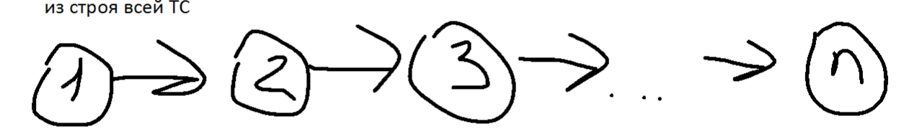

Схема не резервированной ТС
Надежность работы такой ТС можно рассчитать по зависимости 

Р=р1р2р3…рn=ПрI

Где П надежность системы р1р2р3 надежность отдельных элементов

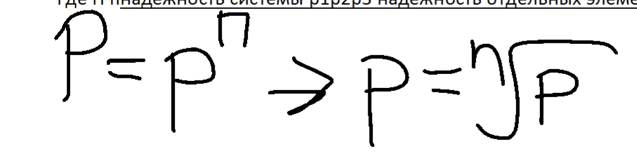

Расчёт надежности резервированного элемента .

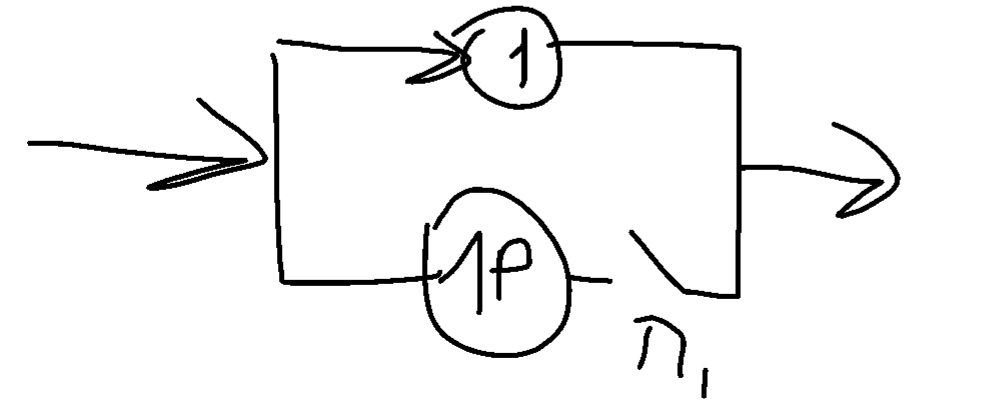

Сначала насчитываем надежность резерва который является участком с последовательным соединением резервного элемента 1р и переключателя П1

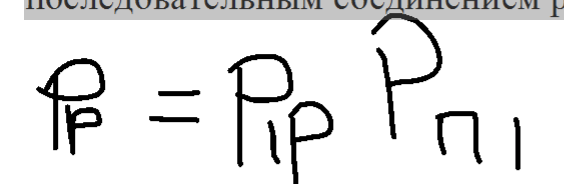

Надежность п1 элемента 1 с учетом резерва определяет через ненадежность которой является вероятность противоположного события — его отказа.
(Q) P1=1-Q
Q1=q1qp= (1-p1)(1-pp)
P1=1-(1-p1)(1-p1pPп1)
Расчёт надежности ТС который имеет в своём составе резервированые элементы

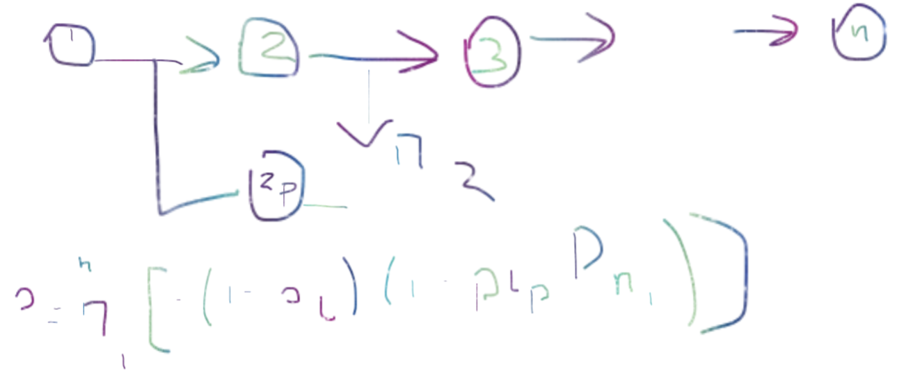

Пример: расчёт вероятносбезооказной работы ТС
1. Создание расчетной схемы
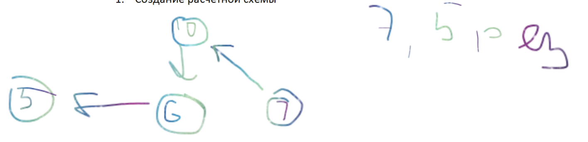

2. 
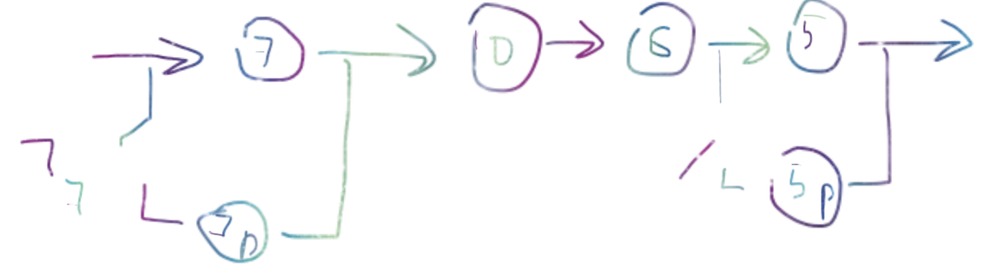

3. Определяем эквивалентные
P7e= 1-(1-p7)(1-P7pPп7)=1-(1-0,98)(1-0,867*0,99)=0,9992

P5e= 1#(1-p5)(1-P5pPп5)=1-(1-0,993)(1-0,89*0,99)=0,9972

4. Находим общую вероятность безотказной работы ТС
P=p7e*p1*p6*p5e=0,9736

Структуры

Этапы создания технической системы

### Циклы жизни ТС

Весь цикл жизни ТС состоит из 4 этапах: cоздание, перемещение, использование по назначению и ликвидацию.
Каждый из этих этапов содержит целый ряд стадий операция и приемов.
На стадии подготовки к созданию ТС устанавливается принципиальная возможность и целесообразность создания ТС’ и составляется тех задания для процесса проектирования, содержание процесса подготовки сильно зависит от вида и степени сложности ТС.

Наиболее важная часть процесса подготовки — поиск информации, исследование.
Целью его является — оценка реализуемости.
Могут проводится исследования двух видов:
1. Исследования преобразования в рабочем процессе
2. Исследование с целью улучшения свойств ТС.
При этом анализируется соответствующее средства в отношении принципов работы, структуры используемых материалов, форм, срока службы, и т.д

Результатом подготовительного процесса является постановка задачи. Перечень тех. Требований к тех системе.

Стадий проектирования охватывает все операции конструкторских работ от предварительных эскизов до деталировочных чертежей и технических условий.

Выходные параметры стадии проектирования становятся исходными данными для стадии подготовки производства, включающие как технические так и организационные мероприятия.

На стадии изготовления материала подвергаются обработке в соответствии с технической инфомации полученной на предыдущих стадиях и материализуется с конструированная ранее ТС.

На этапе перемещения изменяются принадлежность к ТС (производитель—потребитель)

И ее местоположение (местопроизводства —местоиспольщования).
Типичными стадиями на этом этапе является: хранение на складе, реклама,упаковка, транспортировка, монтаж.

ТС используется в производственном процессе для преобразования операндов, с целью получения, желаемых выходных характеристик,.

В следствии морального или физического износа в процессе использования ТС перестаёт отвечать предъявляемым требованиям и ликвидируется.

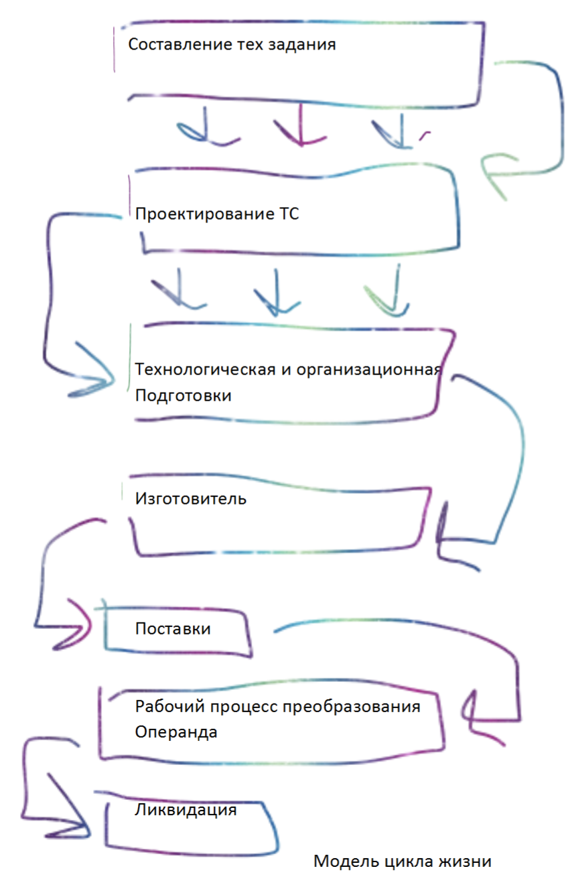

Стадия создания серийного производства

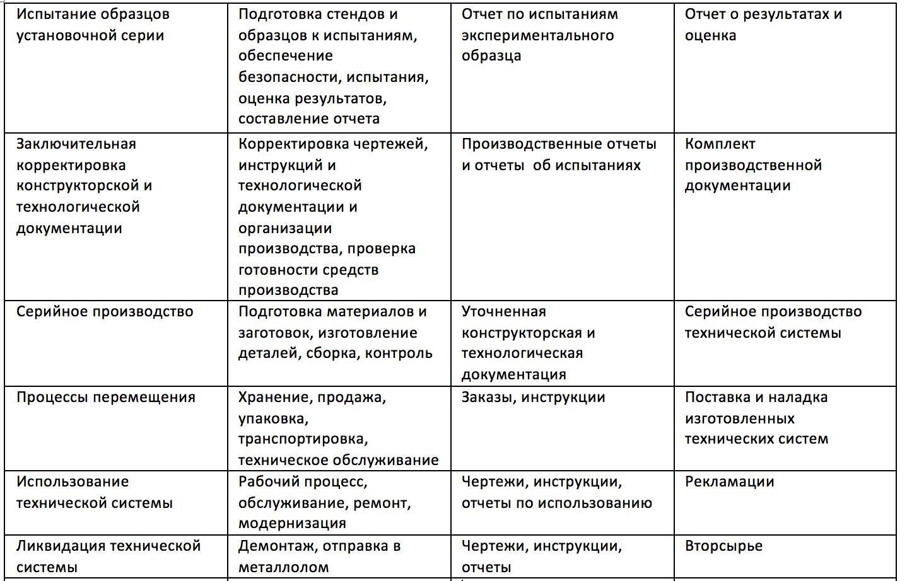

## Системный подход при проектировании
Данный подход отличается от традиционного предположением, что целое обладает такими качествами каких нет у его частей. Данная связь между целым и его частями дает определение системы - это совокупность связанных между собой частей, целью объединения элементов в систему и является получение таких свойств и способностей в выполнении требуемых функций, таких функций, каких нет у каждого отдельно взятого элемента. 

Системный подход к проектированию предусматривает учет системных связей между отдельными частями системы и включает в себя выявление структуры системы, типизацию связей, анализ влияния внешней среды. Системные связи накладывают ограничения на качественные и количественные характеристики компонентов системы. 

Задача инженера при проектировании - разработать при некоторых ограничениях систему обеспечивающую оптимальное выполнение поставленной задачи при некоторых ограничениях накладываемых на результаты решения.

*При проектировании существуют ограничения:*
1. По срокам
2. По оборудованию
3. По вычеслительной технике
4. По материальным затратам
5. По надежности
6. Технологические
7. Административные и т.д.

*Этапы процесса инженерного проектирования:*
1. Определение цели и постановка задачи
2. Определение ограничений, выбор пути решения, разработка плана
3. Формирование способа решения
4. Анализ способа решения
5. Конкретизация решений

На этапах формирования, анализа и конкретизации решений, возникает необходимость выбора соответствующих технических средств, для создания проектируемой системы автоматизации и управления (САУ).

*Технические средства автоматизации и управления используются в САУ для решения следующих задач:*
1. Сбор и преобразование информации для воздействия на процессы
2. Передача информации по каналам связи
3. Преобразование, обработка и хранение информации
4. Формирование команд управления
5. Представление информации оператору

## Структуры систем автоматического управления
*Управление* - выбор совокупности действий на основании информации о состоянии объекта, направленных на поддержание или улучшение функционирования объекта в соответсвии с целью функционирования. 

*САУ* - предназначены для выработки и реализации управляющих воздействий на технологический объект управления (ТОУ)

*Цель функционирования САУ* - оптимизировать технологический процесс по набору критериев

*Выделяют три основных класса функций САУ:*
1. Управляющие функции: регулирование технологических переменных по отклонению (осуществляют системы с обратной связью); логическое управление группой оборудования; оптимальное управление (выполняется в целях достижения экстремизма целевой функции, заданной на параметрах процессов обьектоуправления); адаптивное управление (изменяются параметры САУ при изменении параметров ТОУ)
2.  Информационные функции: сбор, обработка и представление информации; централизованный контроль и измерение технологических параметров; Косвенное измерение (вычисление) параметров процесса (переменных состояния); формирование и выдача данных оперативному персоналу; подготовка и передача информации в смежные систему управления. 
3. Вспомогательные функции: обслуживание и обеспечение контроля за техническими и программными средствами САУ; 

## Классы САУ

САУ подразделяются на следующие классы:
1. Локальные
2. Централизованные 
3. Автоматизированные системы управления техническими объектами и процессами (АСУТП)

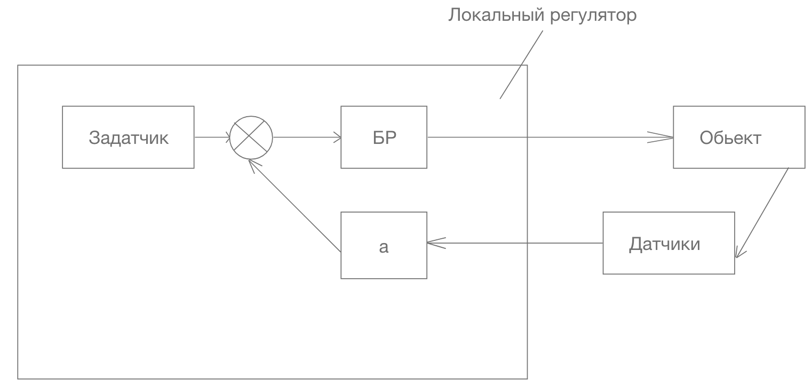
Схема локального регулятора и объекта

а - отрицательный коэффициент обратной связи
БР - блок регулирования или локальный регулятор

Выходная информация об объекте преобразованная датчиком поступает на элемент сравнения. Разница сигналов от датчика и с выхода датчика формирует сигнал ошибки управления, по которому блок регулирования формирует сигнал ошибки управления. По которому блок регулирования формирует сигнал управления на объект. Цель управления: с минимальной ошибкой и максимальной скоростью регулировать работу объекта для увеличения эффективности выполнения заданной функции.

### Локальная САУ

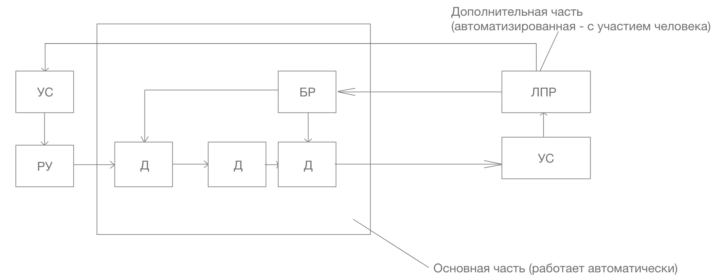

ЛР - локальный регулятор, обычно имеет несколько вводов (датчики и нормировка датчиков, передача данных с компьютера, корректировка датчика); ЛПР - лицо, принимающее решение (меняет уставки задачника локального регулятора, осуществляет ручное управление); РУ - ручное управление; ИУ - исполнительное устройство; Д- датчик; УС- устройство сопряжения или связи(Ethernet); ТОУ-технологический объект управления

Элементы обведенные рамкой на рисунке - классическая система с локальным регулятором. Пунктирными стрелками (верхняя стрелка ЛПР -> УС) показан путь, который позволяет ЛПР через устройства связи и ручного управления воздействовать на исполнительное устройство непосредственно. 

Ручное управление применяется в случае необходимости: обрабатывать аварийные ситуации; не допускать больший изменений в контролируемом объекте.

При этом ручное управление должно иметь высокий коэффициент надежности. 

### Централизованная САУ

Может быть однаканальной и многоканальной.

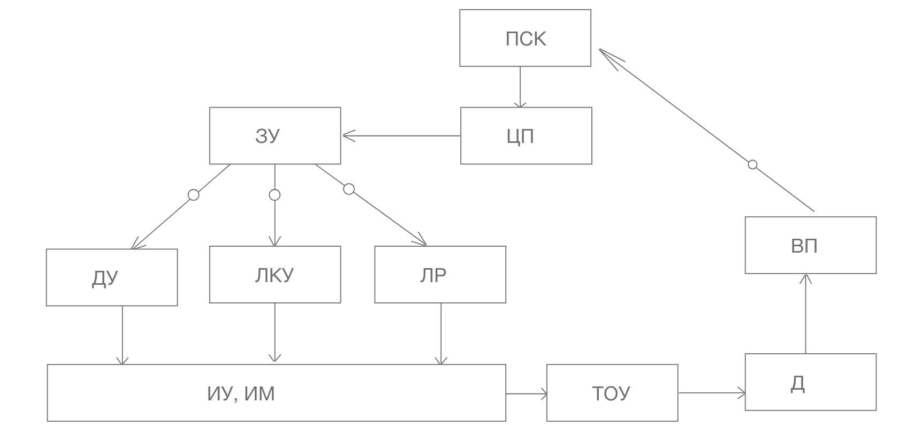
Функциональная схема одноканальной системы

ЗУ - задающее устройство; ПСК - приборы сигнализации, контроля табло; ЛКУ-лигико0командное управление ; ДУ - дистанционное управление; ИУ - исполнительные устройства; ИМ - исполнительные механизмы; ВП - вторичный преобразователь; ЦП - центральный пульт

Система устроена таким образом, что все решения принимает единый центральный управляющий орган, который соединен одним каналом связи с датчиками и с исполнительными устройствами. По мере усложнения объекта управления и связанных с ним решаемых задач увеличивается поток информации по каналу связи. Начиная с некоторого уровня сложности системы, возможности одного канала связи становятся не достаточными, что обуславливает переход к многоканальным системам. 

### АСУТП

Предназначена для выработки и реализации управляющих воздействий на ТОУ. *ТОУ* - совокупность технологического оборудования и реализованного на нем, по соответствующим инструкциям или регламентам, технологического процесса производства. 

*К ТОУ относятся:* 
1. Технологические агрегаты и установки (группы станков), реализующие самостоятельный технологический процесс
2. Отдельные производства (цеха, участки) или производственный процесс всего промышленного предприятия, если управление этим производством носит в основном технологический характер. Т.е. заключается в реализации рациональных режимов работы взаимосвязанных агрегатов (участков, производств)

Совместно функционирующие ТОУ и управляющая ими АСУТП образуют автоматизированный технологический комплекс (АТК).

*АСУТП* -  челокеко-машинная система управления обеспечивающая автоматизированный сбор и обработку информации необходимой для оптимизации управления технологическим обьектом в соответствии с принятым критерием. 

*Цели АСУТП:*
1. Экономия топлива, сырья, материалов и других производственных ресурсов
2. Обеспечение безопасности ТОУ
3. Повышение качества выходного продукта (изделия) или обеспечения заданных значений параметров выходных изделий
4. Снижение затрат живого труда. Достижение оптимальной загрузки (использования оборудования)
5. Оптимизация режимов работы технологического оборудования

В АСУТП существует два класса: *централизованные* и *распределенные* .

#### Централизованные АСУТП
Имеют одну ЭВМ, устанавливаемую в машинном зале центрального диспетчерского поста.

#### Распределенные АСУТП
В распределенных АСУТП применяется иерархия вычислительных средств. Центральная управляющая вычислительная машина соединена вычислительной сетью через устройство связи с локальными контроллерами. Задача центральной УВМ - координация работы локальных контроллеров, задание уставок. Локальные контроллеры реализуют многоканальное регулирование соответствующими частями ТОУ

Такое построение системы повышает ее надежность, поскольку при выходе из строя центральной УВМ локальные системы продолжают работать на основе выданных им данных в предыдущие моменты времени. 

 *Структуры распределенных АСУТП*

Структура распределенных АСУТП определяется топологией локально вычислительных сетей. Которые обьединяют все вычислительные средства системы. Применяют 3 структуры распределенных систем: *радиальные* (звезда), *кольцевая* (кольцо), *магистральная*.

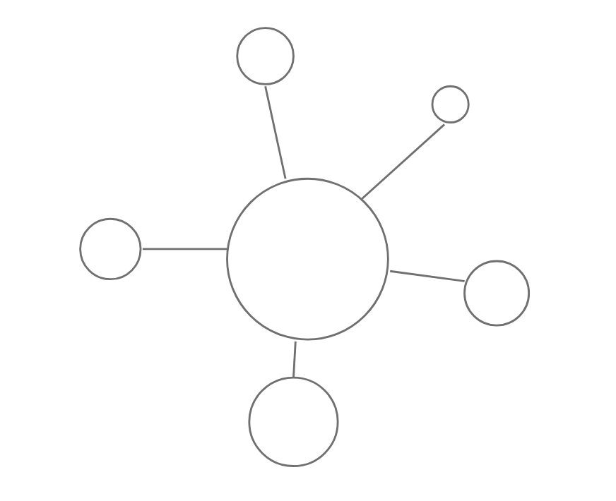
Радиальная

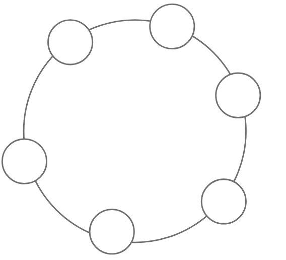
Кольцевая

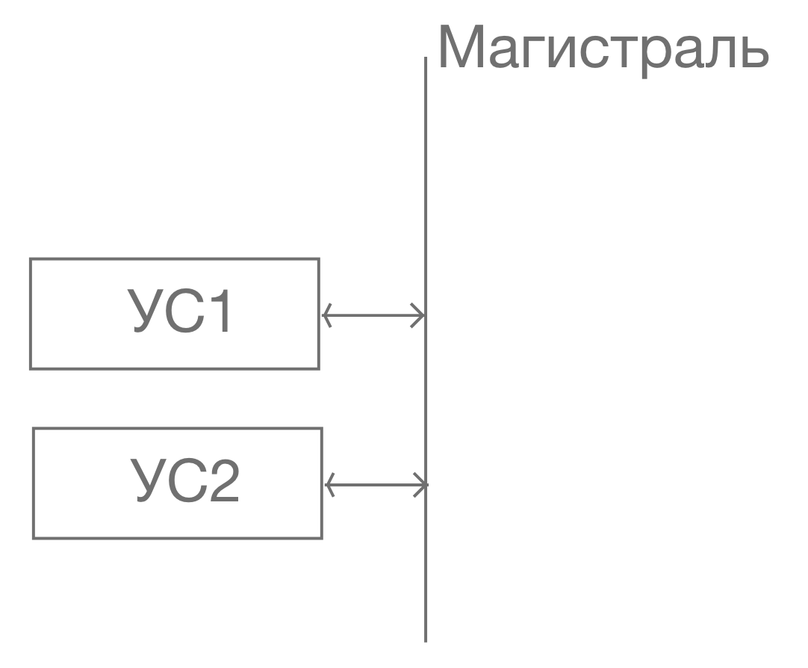

Радиальная распределенная схема имеет центральное вычислительное и коммутирующее устройство и подсистемы, связанные с ним своей локальной связью.

В радиальной системе имеется гораздо больший запас по быстродействию тк все линии выделены отдельно и нет необходимости в адресной идентификации.

*Преимущества радиальной системы:*
1. Линии связи выделены для каждого направления, обеспечивает максимальную скорость обмена
2. Подсистемы являются независимыми
3. Устройства связи получаются более простыми
4. Вывод из строя одной связи не затрагивает другие

*Недостатки радиальной системы:*
1. Большое количество линий связи
2. Дороговизна линий связи
3. Узлы взаимодействуют между собой только через центральную систему, если центральная система выйдет из строя то локальные системы не могу взаимодействовать между собой
4. Высокие требования к физической организации центра

- - - -

## Автоматизация непрерывных и дискретных технологических процессов
### Методика анализа технологическог опроцеса как объекта управления

При разработке АСУТП одним из важнейших этапов, одним их важнейших этапов синтеза системы является анализ ТП как объекта управления, то есть выявление структуры процесса, определение входных и выходных переменных, нахождение математический зависимостей между входными и выходными переменными, описывающих поведение изучаемого ТП.

Рассмотрим на примере металлургического процесса.

Любой металлургический процесс предназначен для изменения физических или физико-химических свойств, подаваемого в металлургический агрегат материального потока с затратой на это определенного количества энергии, зависящего от конструктивных и технологических особенностей агрегата. Поэтому для любого металлургического процесса можно определить *входной материальный поток* свойства которого изменяются в данном процессе, *выходной материальный поток* - результат обработки входного материального потока. Для осуществления металлургического процесса в агрегат подводится энергия. 

Выходной энергетический поток отождествляется с отводимой из агрегата энергией выходных продуктов или физико химических изменений материальных потоков. Состояние входных материальных и энергетических потоков характеризуется некоторой совокупностью входных переменных например: величина потока (расход вещества, энергии и тд), содержания отдельных компонентов, давления и тд.

Входные переменные можно классифицировать следующим образом:

1. Управляющие входные переменные Vi (управляющие воздействия)  - те которые можно изменить добиваясь определенной цели, например заданных характеристик металлургических процессов.
2. Не управляемые входные переменные  (возмущающие воздействия) - те которые не возможно изменять каким-либо образом. Подразделяются на *контролируемые Zi* (те переменные о численных, значениях которых в любой момент времени может быть получена информация  с помощью проборов или методов)  и  *неконтролируемые Эпрелонт i* (те информация о численных значениях которых не доступна).

Состояния выходных материалов и энергетических потоков характеризуется некоторой совокупностью выходных переменных (управляемых величин) Xi, зависящий от входных переменных, управляющих Vi, так и возмущающих Zi, Эпсилонт i, воздействий.

К выходным переменных относятся такие как: количество выходных материальных и энергетических потоков.

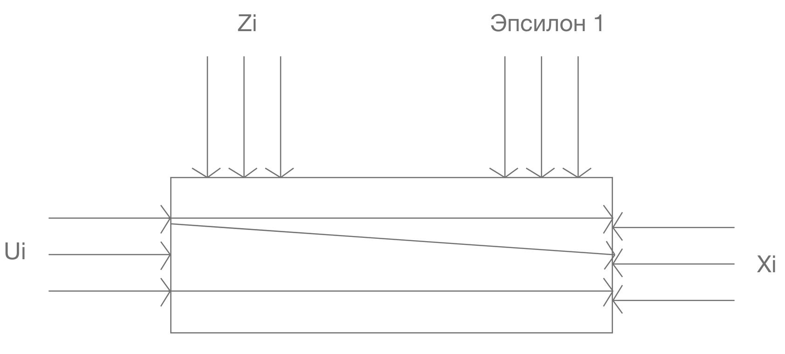
Структурная схема объекта управления, стрелками показана взаимосвязь выходных и входных переменных

Пример: рассмотрим методику анализа тех процесса как объекта управления на примере процесса рудотермической электроплавки медных концентратов.

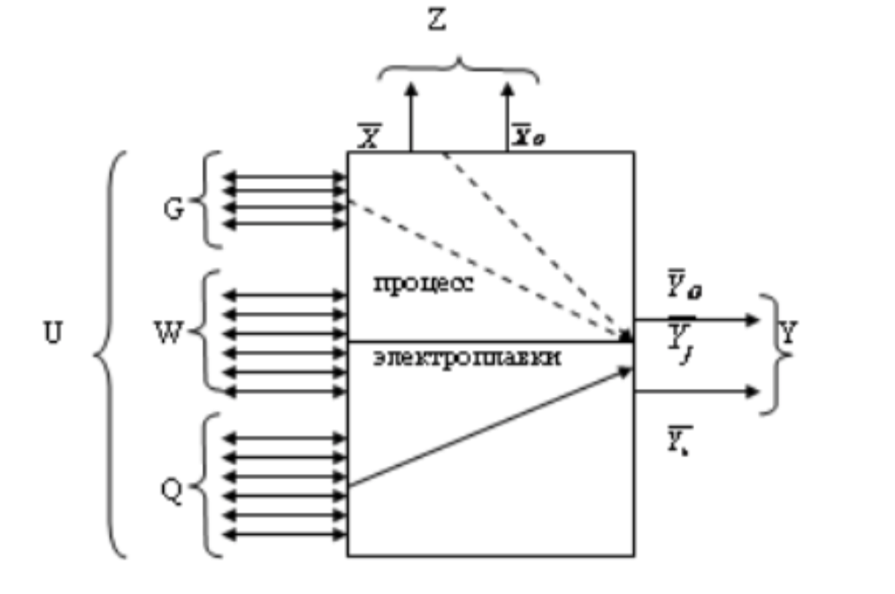

Схема входных и выходных переменных процесса электроплавки.

1. Входными материальными потоками процесса электроплавки является: непрерывно поступающие топливо (электроэнергия) и шихта, периодически загружаемые конвертерный шлак. Выходными – периодически сливаемый штейн и отвальный шлак.
Непрерывность процесса плавлении шихты и шлакообразования, позволяет отнести электроплавку к числу непрерывных объектов.
2. Показатели определяющие и характеризующие протекания процесса электорплавки имееют различную физическую природу: расходы материальных (G) и энергетических (W) потоков, химические составы, температуры техникоэкономические показатели.
Они мб отнесены к числу входных, выходных или режимных переменных объектов управления, управляемых (U) или неуправляемых (Z), контролируемых непрерывно, дискретно или неконтролируемых.
Таким образом, электротермическая плавка является многомерным объектом управления.
3. Большой объем ванной печи, значительная емкость бункеров шихтопитателей, обуславлевают значительную инерционность процесса плавки.
4. На процесс плавки оказывают влияние ряд медленно изменяющихся неконтролируемых факторов – старение агрегата, дрейф минералогического состава сырья, настылеобразования приводя к не стационарности процесса.
5. Наличие неконтролируемых переменных, дискретный характер контроля рядя переменных, высокий уровень помех в каналах контроля приводят к неполноте информации о процессе.

Схемы автоматизации типовых технологических процессов

Управление процессов в реальном времени. Управляющий компьютер должен работать со скоростью соответствующей скорости процесса. Само понятие реальное время указывает на то, что в реакции компьютерной системы на внешние события недолжно быть заметно запаздывания

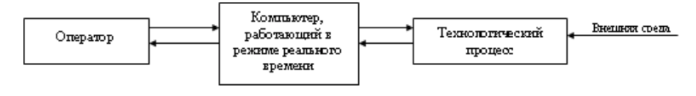

Параллельность – одно из важных сво-в реального времени из этого следует важный вывод компьютер взаимодействующий с такими процессами или управляющий им должен учитывать параллельную природу и должен уметь управлять параллельными задачами.
Рассмотрим в качестве примера управление пресса для пластика.
Компьютер должен одновременно регулировать температуру (поддерживать ее постоянной) и координировать последовательность технологических операций.

Температура пластика в контейнере должна поддерживаться в пределах узкого диапазона УВМ периодически считывает текущую температуру и рассчитывает тепло необходимое для ее поддержания на требуемом уровне.

Тепло поступает от нагревательного элемента управляемого компьютером. Время работы нагревательного элемента согласовано с количеством тепла которое необходимо подвести.

Нижняя часть пресса состоит из поршня, выталкивающего определенное количество расплавленного пластика через насадку. Когда поршень находится в крайнем правом положении, цилиндр заполняется пластиком. Затем поршень быстро перемещается влево, выдавливая требуемое количество пластика.

Положение поршня контролирует импульсный датчик, который генерирует определенное число импульсов на каждый миллиметр перемещения поршня, а объем выдавливаемого пластика определяется числом импульсов за время перемещения. Движение поршня прекращается при достижении заданного числа импульсов.

Чтобы обеспечить заданную производительность, температура пластика должна иметь заданное значение к тому моменту, когда поршень при движении вправо минует выходное отверстие контейнера.

В этом примере компьютерная система должна регулировать температуру и давление поршня одновременно. Значение температуры поступает в виде непрерывного сигнала от датчика. 

Положение поршня
засчитывается исходя из числа импульсов. Кроме того, еще два датчика генерируют двоичные сигналы при достижении поршнем крайнего положения.

Управление таким процессом с помощью компьютера осуществляется на принципе управления с помощью прерывания.

Главная сложность программы управления прессом – необходимость организации переключения между задачами. На практике проблема решается с помощью двух независимых программ, выполняемых на одной машине: одна регулирует температуру, а другая – управляет перемещением поршня.
Метод сигнализации, называемый прерыванием, используется для переключения центрального процессора с исполнения одной задачи на другую.

Управления последовательностью событий и бинарное управление. Химический реактор представленный на рисунке 5 – пример системы управления последовательностью событий.

В реакторе происходит перемешивание реагентов с помощью смесителя. Уровень давления контролируется датчиком давления PE, а температура – датчиком TE.

Температура регулируется горячей или холодной водой, подаваемой в окружающий бак кожух; потоки воды регулируются клапанами Г (горячего) и Х (холодного).

В этом примере в реакторе выполняются следующие операции:
1. Открыть клапан А и залить реагент 1.
2. Если датчик Д показывает, что достигнут новый требуемый уровень, то закрыть клапан А.
3. Запустить смеситель.
4. Открыть клапан Б и залить реагент 2.
5. Если датчик Д показывает, что достигнут новый требуемый уровень, то закрыть клапан Б.
6. Открыть клапан Г для нагрева бака.
7. Если датчик Т показывает, что достигнута требуемая температура, то закрыть клапан Г.
8. Установить таймер на время протекание химической реакции.
9. При срабатывании мера – ’’время истекло’’ – остановить смеситель.
10. Открыть клапан Х для охлаждения бака.
11. Проверить температуру в баке, если температура упала ниже предела, то закрыть клапан Х и открыть клапан В для опорожнения бака.
12. Закрыть клапан В. Повторить все этапы.

Эта система предназначена для управления очередностью выполнения операции, которая зависит от некоторых логических условий. Входные и выходные данные системы являются бинарными в том смысле, что датчики контролируют два состояния или граничное условие. Входные и выходные данные системы являются бинарными в том смысле, то датчики контролируют два состояния или граничное значение. 

Например, клапан открыт или закрыт, индикатор закрыт или нет и так далее.

Команды управления имеют аналогичный формат: запустить или остановить двигатель, включить/отключить нагреватель и т. п.

Если задача управления основана только на бинарной логике, то очевидно, что решать удобнее и проще цифровыми средствами. 

Существуют так называемые программируемые контроллеры, специально созданные для решения таких задач.
Типовые схемы регулирования температуры

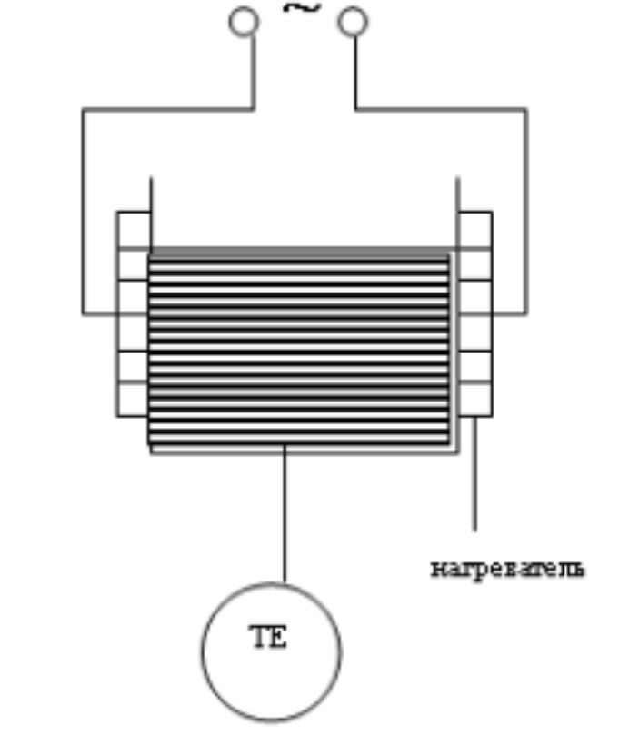

В данном баке температура должна поддерживаться постоянной. В этом примере все сигналы аналоговые, т.е. изменение температуры отслеживается непрерывно (в отличии от предыдущего примера, где проверялось лишь превышение порогового значения), а подача тепла может регулироваться плавно. Измерения производятся периодически, например каждую секунду, и поступают в компьютер. Текущее значение температуры сравнивается с заданным (опорным), которое хранится в компьютере.

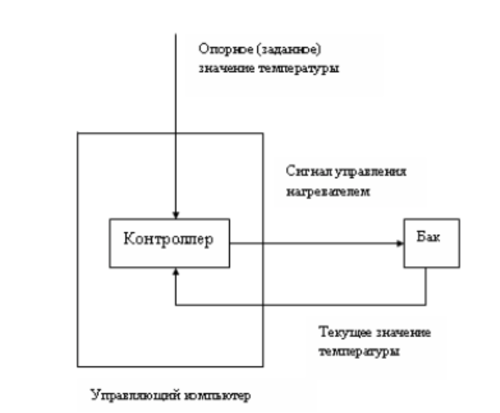

Контур управления – система регулирования температуры
Контур управления

Управление состояния динамических систем
Состоянием называется набор всех переменных – так называемых переменных состояния. Если известны текущее состояние системы и входные сигналы, то можно предсказать ее дальнейшее поведение. Другими словами, состояние – это минимальное количество информации о системе, которое необходимо, чтобы предсказать ее будущее поведение.

Состояние Х можно представить как вектор – столбец, компоненты которого – переменные состояния Х = (х1,х2,…,хn)T

Непосредственно измерить все переменные состояния практически невозможно. Поэтому описание в пространстве состояний называется также внутренним описанием. Выходные величины, т.е. измерения, обозначаются через y1,у2,…,уn и составляют вектор У
На любую техническую систему влияют сигналы двух типов – сигналы, которые можно измерить вручную или автоматически какими-либо техническими средствами, и сигналы, которыми управлять невозможно.

Сигналы первого типа называются управляющими сигналами или переменными управления u1,u2,…,ur и составляют вектор U
U = (u1,u2,…,ur)

Входные сигналы второго типа могут влиять на систему, но не поддаются управлению.

Все эти сигналы обозначаются вектором V
V = (v1,v2,…,vm)

Целью системы управления является вычисление на основе имеющихся измерений У таких сигналов U, чтобы, несмотря на влияние возмущений V, техническая система выполняла поставленные задачи. Управляемую систему можно представить в виде блок-схемы.

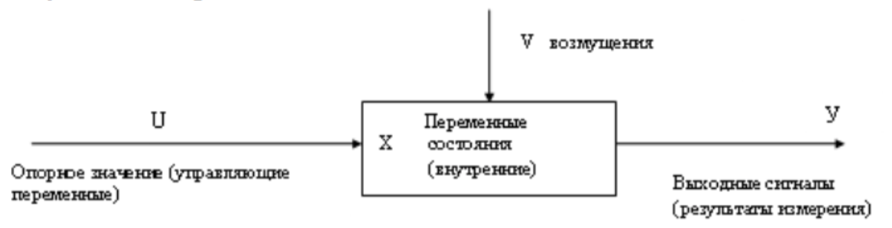

Блок-схема управляемой системы

Описание линейной системы в пространстве состояния
Большинство процессов можно смоделировать линейными дифференциальными уравнениями, в которых отсутствуют члены, содержащие произведения переменных состояния типа х12; Х*U;или Х1*Х2. Линейная система, имеющая n переменных состояния и r входных переменных, описывается следующими уравнениями состояния с постоянными коэффициентами:
a11x1 + a12x2 +…+ a1nxn + b11u1 + b12u2 +…+ b1rur
.
.
.
an1x1 + an2x2 +…+ annxn + bn1u1 + bn2u2 +…+ bnrur
где параметры aij и bij – константы.

С помощью диф уравнений можно найти динамическое решение X(t) при произвольных входных сигналах U(t). Начальные условия определяются n константами.

В матричном виде уравнения состояния записываются проще
dX / dt = AX + BU

Где А и В матрицы, содержащие коэффициенты

При единственном управляющем сигнале матрица В имеет только один столбец.

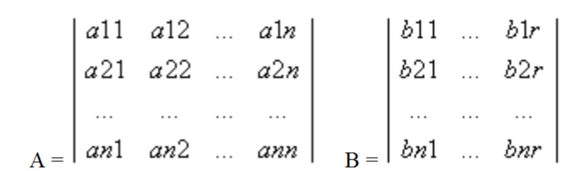

Между внутренними переменными состояния Х и измерениями У существует линейная зависимость. Кроме того, иногда имеется прямая связь между управляющими переменными U и выходными переменными У.

#Кригер